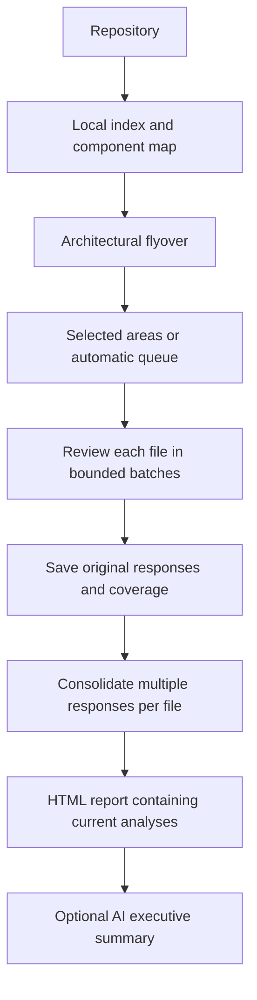

# Architecture and coverage

[Back to README](../README.md)

## Flow description

In the default `--output-mode prompt`, njordcup reviews code file by file,
consolidates responses for each file, and optionally summarizes the saved audit.



### 1. Index and map the repository

Eligible files are indexed locally with original line numbers, bounded chunks and
available symbol/import/call information. Dependency manifests and directories help
group files into components. The architectural flyover samples components in pages
of up to 30 files and saves descriptions for later review context. Sampling does
not count as a completed security review. Compatible implementation-analysis results
can supply architectural descriptions without repeating those mapping calls.

### 2. Review files within selected areas

An area defines a collection of target files. Select an area interactively or with
`--area`; `--automatic` processes unfinished component areas sequentially. Within
an area, `--workers N` can review N files concurrently (default: 1); see
[worker scheduling and checkpoints](workers.md). Every source-review request
targets chunks from **one file**. A small
file may need one request, while a large file requires several bounded batches.

Requests may also contain bounded excerpts from related files, architectural
memory, previous analyses and compatible implementation descriptions. The model
is asked to describe potential issues using **Title, Description, Impact and
Remediation**, with source evidence, preconditions and uncertainty. Its response is
saved verbatim, with chunk coverage, after each batch. Headings are instructions
for the model, not a required output format.

Related files provide context, but there is currently no dedicated whole-component
security pass that systematically follows every interaction between files. Prompt
mode also has no model-directed retrieval loop or separate finding-verification
pass. Explicit structured modes add those steps, as described below.

### 3. Consolidate each file's responses

A file with one response uses that text as its analysis. When a file has multiple
responses, an additional model pass combines them once its source review is
complete. The prompt asks the model to preserve distinct issues, source references,
evidence, uncertainty and contradictions, and merge observations only when they
describe the same issue.

If the combined input is too large, njordcup splits the serialized analyses into
bounded text fragments, summarizes each, then combines summaries in successive
pairwise passes. Fragments can divide records; they do not necessarily align with
issue boundaries. This process can lose detail, so original responses remain saved
and appear under **Original analysis parts** in the HTML report.

Consolidation uses saved analyses; it does not review additional source code.
Responses are checkpointed for resumption. Pending consolidation leaves the file
analysis incomplete even when all source chunks have been processed. An interrupted
review reuses compatible completed chunks and consolidation checkpoints.

### 4. Combine areas into the current report

Reports use the latest saved attempt for each area in the active snapshot. Older
attempts and archived snapshots remain in memory but are excluded from the current
report. Files appearing in several areas receive one report entry containing their
unique response parts, retaining area provenance.

A saved file consolidation is reused only if it covers that exact set of parts.
Otherwise the report retains the separate parts and marks consolidation pending.
Offline reporting does not run a new cross-area consolidation. Grouping identical
response IDs removes repeated copies of the same response; it does not semantically
deduplicate similar vulnerability claims in different responses.

### 5. Summarize the saved audit

| Command | Behavior |
| --- | --- |
| `--summary` | Offline JSON aggregation of saved progress, analyses, coverage and limitations |
| `--report` | Offline HTML report with current analyses and any matching saved executive summary |
| `--report --synthesize` | Model-generated executive summary of the saved security audit, included in HTML |

```sh
python3 -m njordcup /path/to/repo --report --synthesize \
  --model YOUR_MODEL --base-url http://localhost:11434/v1
```

The executive summary connects observations, prioritizes potential issues and
describes uncertainty and coverage gaps. It uses the same bounded summarization
process and retains original analyses below the summary. It performs no new source
review and does not change findings, scanner dispositions or coverage. Matching
completed synthesis is reused; changed input invalidates the old summary.

Implementation analysis is stored separately and remains component-based. Use
`--implementation-report --synthesize` with model settings for its own executive
summary. SARIF investigations cover reported source regions, not every line of
the affected files; prompt-mode scanner verdicts remain inconclusive.

Completed coverage means code was processed, not that it is secure. See
[per-file reporting](reporting.md#one-security-analysis-per-file),
[report synthesis](reporting.md#optional-ai-executive-summary) and
[memory and resumption](memory.md) for details.

## Indexing and retrieval details

The local index inventories every eligible file and line before model analysis.
Discovery is language agnostic: any UTF-8 text file is eligible, including unknown
extensions, extensionless scripts, documentation and configuration. No language
allowlist or parser installation is needed. Non-UTF-8 files are currently skipped.

Files are grouped by known nested dependency manifests or module directories.
`--index-mode auto` (default) enhances Python with AST symbol ranges and import/call
metadata, and uses optional Tree-sitter grammars for supported languages; other
text receives best-effort lexical metadata. See [optional syntax indexing](indexing.md). `--index-mode text`
uses only bounded text chunks and Unicode-aware identifier search, even for Python.
This mode does not infer symbols, imports or call edges. Manifest dependency edges
remain available. Both modes retain original line numbers and cover eligible lines.

Index statistics and focused-review coverage count files by indexing method:
`python_ast`, `tree_sitter`, `lexical`, and `text`. Missing symbol information is not evidence that
a file has no functions. Lexical edges are navigation hints, not a sound semantic
call graph or taint analysis. Model understanding still varies by language.

Large files are chunked with original line numbers and preferred symbol boundaries.
Oversized functions fall back to bounded line chunks. A single line exceeding the
batch budget remains explicitly unreviewed. Default file-size limit: 2 MB, adjustable
with `--max-file-bytes`. Binary/control-byte files, common credential filenames,
lockfiles, SARIF artifacts and symlinks are excluded. Additional filters are defined
in [njordcup/repository.py](../njordcup/repository.py). UTF-8 detection and filename
exclusions are not comprehensive secret detection.

Prompt-mode audits always use progressive component flyovers. Structured-mode
audits of multi-component repositories, repositories over 2,000 lines or over 40 files use
progressive component flyovers. All selected files belong to an area, with no global
eight-area cap. Components are analyzed in pages of up to 30 files. Each completed
page is saved, and later runs resume pending pages. A page's model analysis still
samples source; indexing completeness is distinct from architectural understanding.
Small single-component repositories in structured mode retain the lightweight flyover.

Default prompt-mode reviews use bounded source batches per file and automatically
selected related source excerpts. Responses are saved verbatim, without automatic
citation validation or a separate verification pass. Larger files receive a final
consolidation pass; original responses remain available.

Structured review uses bounded source batches and up to three retrieval rounds. The
model can request chunks, original line locations, or searches across the complete
index. Search ranks paths, literal text and whole identifiers, splits camelCase and
snake_case identifiers into fragments, and weights rarer terms more heavily.
Quoted searches match literal phrases, including punctuation. Already loaded chunks
are excluded before limiting search results, so repeated searches can reach new code.
Matches return source chunks with surrounding lines, not isolated matching tokens.
Literal searches scan the indexed chunk text; there is no embedding model or external
search service. Related import/caller candidates help navigation. Findings are
challenged in a second model pass and checked against exact supplied source lines.
Reports count reviewed chunks, lines, symbols and heuristic attack-surface signals.
Coverage measures processing, not the absence of vulnerabilities.

## Boundaries

Repository code and fixtures are never executed. Source and scanner messages are
untrusted prompt data; neither prompt-injection resistance nor detection accuracy
is guaranteed. Use a stable checkout. File exclusions are not a comprehensive secret
redactor. The implementation has no sound cross-language taint engine, sandboxed
exploit testing, or distributed job scheduler.

## Related guides

- [Memory and invalidation](memory.md)
- [Resource planning and benchmarks](resource-planning.md)
- [Testing and model evaluation](testing.md)
